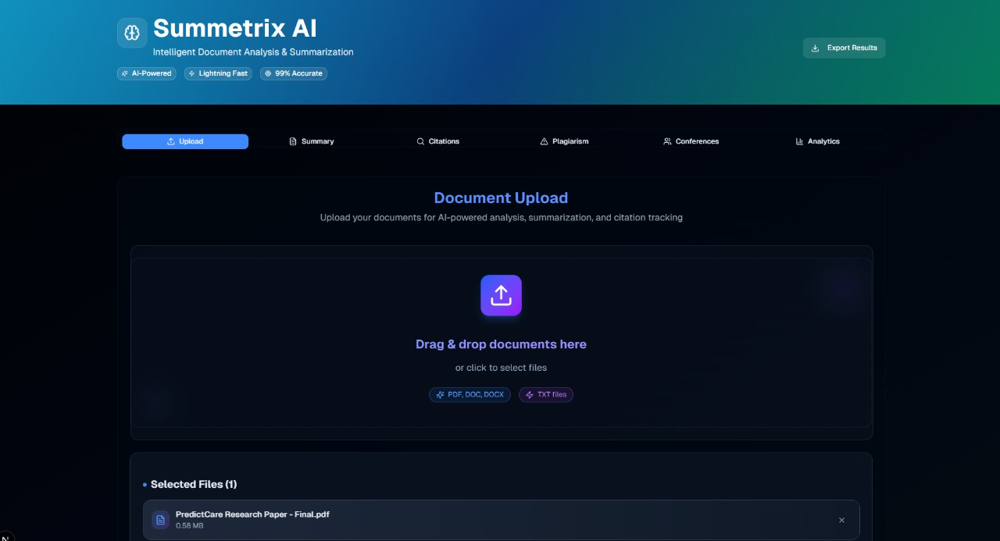
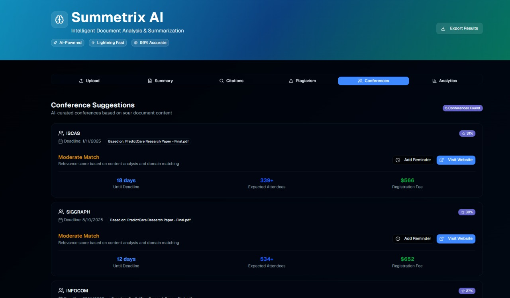
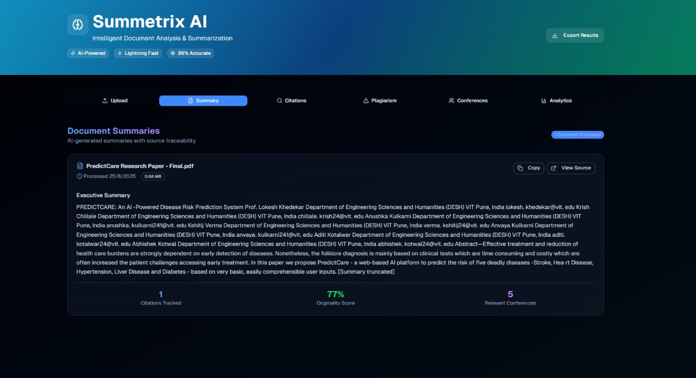
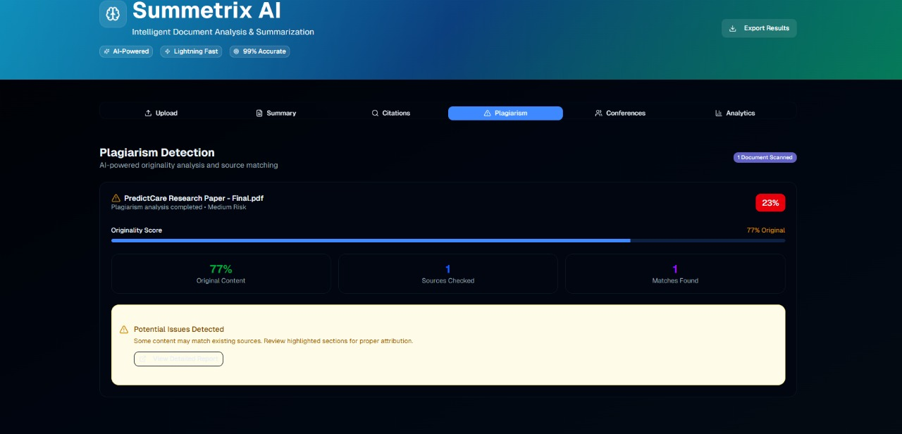

# 📄 AI Document Summarizer & Citation Tracker  

An intelligent, full-stack tool for **summarizing long documents, tracking citations, and detecting plagiarism**. Built for researchers, students, and professionals who work with large volumes of text. Powered by the **Gemini API** for high-quality summaries, with a modern React/Next.js frontend and a robust Django backend.  

---

## 🚀 Features  

- **AI-Powered Summarization**: Generate concise, context-aware summaries from long documents using the Gemini API.  
- **Citation Tracking**: Automatically extract, track, and organize references and citations.  
- **Plagiarism Detection**: Check documents against external sources and highlight potential plagiarism (Copyleaks API).  
- **Conference Suggestions**: Get smart conference recommendations using ML models.  
- **Multi-Format Support**: Works with PDF, DOCX, and TXT files.  
- **Professional PDF Export**: Download detailed PDF reports of your analysis.  
- **Analytics Dashboard**: Visualize document stats, citation counts, and more.  
- **User-Friendly Interface**: Upload, summarize, analyze, and manage documents in one place.  

---

## 🛠️ Tech Stack  

- **Frontend**: Next.js (React), Tailwind CSS, Radix UI  
- **Backend**: Django, Django REST Framework  
- **AI Model**: Gemini API (summarization), Copyleaks API (plagiarism)  
- **ML Models**: Conference suggestion (scikit-learn, sentence-transformers)  
- **Database**: SQLite (dev), PostgreSQL (prod-ready)  
- **Document Parsing**: PyPDF2, python-docx  

---

## 📦 Project Structure  

```
ai-doc-summarizer/
├── backend/           # Django backend (API, models, services)
│   ├── api/           # Core API logic
│   ├── document_summarizer/ # Django project config
│   ├── media/         # Uploaded files
│   ├── Conference_models/ # ML models for conference suggestions
│   └── ...
├── Web_frontend/      # Next.js frontend
│   ├── app/           # Main app pages
│   ├── components/    # React components
│   ├── lib/           # API service
│   └── ...
└── ...
```

---

## 📥 Installation & Setup  

### 1. Clone the repository  

```bash
git clone https://github.com/moana-pri/ai-doc-summarizer.git
cd ai-doc-summarizer
```

### 2. Backend Setup  

```bash
cd backend
pip install -r requirements.txt
# Copy and edit environment variables
copy env_example.txt .env  # (use 'cp' on Linux/Mac)
# Edit .env and add your API keys (Gemini, Copyleaks)
python manage.py makemigrations
python manage.py migrate
python manage.py runserver
# Backend runs at http://127.0.0.1:8000/
```

### 3. Frontend Setup  

```bash
cd Web_frontend
pnpm install  # or npm install
pnpm dev      # or npm run dev
# Frontend runs at http://localhost:3000/
```

---

## 🔗 Usage Guide  

1. **Start the backend**: `python manage.py runserver` (from `backend/`)
2. **Start the frontend**: `pnpm dev` or `npm run dev` (from `Web_frontend/`)
3. **Open** [http://localhost:3000/](http://localhost:3000/) in your browser.
4. **Upload a document** (PDF, DOCX, TXT).
5. **View summary, citations, plagiarism results, and conference suggestions**.
6. **Export results as PDF** or view analytics dashboard.

---

## 🧩 API Overview  

**Backend API Endpoints:**  

- `POST /api/documents/upload/` — Upload a document
- `POST /api/documents/{id}/summary/` — Generate summary
- `POST /api/documents/{id}/analyze/` — Analyze document (citations, plagiarism, conferences)
- `GET /api/documents/{id}/citations/` — Get citations
- `GET /api/documents/{id}/plagiarism/` — Get plagiarism results
- `GET /api/documents/{id}/conferences/` — Get conference suggestions
- `GET /api/analytics/` — Get analytics data
- `GET /api/health/` — Health check

See `backend/README.md` for full API and model details.

---

## 🧑‍💻 Development & Testing  

### Backend
- Run tests: `python manage.py test`
- Create/apply migrations: `python manage.py makemigrations && python manage.py migrate`
- Access Django admin: [http://127.0.0.1:8000/admin/](http://127.0.0.1:8000/admin/)

### Frontend
- Main dev command: `pnpm dev` or `npm run dev`
- All API calls are proxied to the backend

---

## 🐞 Troubleshooting  

- **API Key Errors**: Check `.env` in `backend/` for valid Gemini and Copyleaks keys
- **File Upload Issues**: Ensure `media/` exists and is writable
- **Model Loading Errors**: Ensure `Conference_models/` exists with required files
- **CORS Issues**: Backend allows requests from `localhost:3000` by default
- **Frontend/Backend Connection**: Use `/test-connection` page in frontend to verify

See `TROUBLESHOOTING.md` and `backend/FINAL_FIXES_SUMMARY.md` for more.

---

## 🤝 Contributing  

Pull requests are welcome! Please open an issue first to discuss major changes.

---

## 📄 License  

This project is for educational and research purposes.

---

## 🖼️ Screenshots

| Landing Page | Conference Suggestions | Analytics Dashboard |
|:------------:|:---------------------:|:-------------------:|
|  |  |  |

| Summary Page | Plagiarism Detection |
|:------------:|:-------------------:|
|  |  |

> **Note:** All screenshots are from the actual running application and demonstrate the main features and UI.
